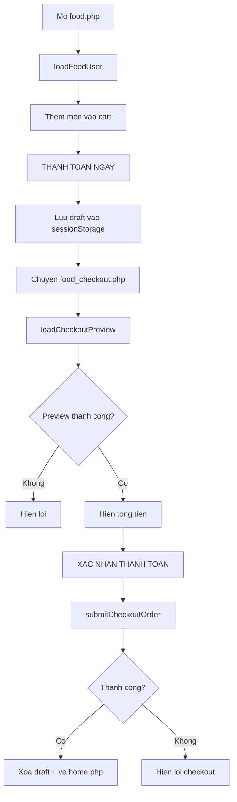

# Luong Frontend khach hang (food.js)

## 1. Pham vi file
- View/pages/food.php
- View/pages/food_checkout.php
- View/js/food.js

## 2. Vai tro tung page
### food.php
- Hien thi danh sach mon va gio hang.
- Cho phep chon phuong thuc thanh toan (hien tai chi co `Tien mat`).
- Nut `THANH TOAN NGAY` se luu draft checkout vao sessionStorage va chuyen trang.

### food_checkout.php
- Doc lai draft checkout da luu.
- Goi API `checkout_preview` de lay tong tien theo du lieu hien tai trong DB.
- Cho phep xac nhan de goi API `place_order`.

## 3. State va key dung trong frontend
### Bien state trong JS
- `cart`: gio hang tam tren trang food.
- `CHECKOUT_DRAFT_KEY = food_checkout_draft_v1`: key sessionStorage luu draft checkout.

### Cau truc draft checkout
```json
{
  "phuongThuc": "Tien mat",
  "items": [
    { "foodId": 1, "tenFood": "Bap Caramel", "price": 65000, "soLuong": 2 },
    { "foodId": 2, "tenFood": "Coca", "price": 30000, "soLuong": 1 }
  ]
}
```

## 4. Luong chi tiet tren trang food.php
1. `initializeFoodPage()` duoc goi khi `data-page != food-checkout`.
2. `restoreCartFromCheckoutDraftIfNeeded()` phuc hoi gio hang neu URL co `restoreCheckout=1`.
3. `loadFoodUser()` goi API:
   - `GET ../../Controllers/foodController.php?action=list_all`
   - Render tung mon, nut mua bi disable neu het hang hoac gia khong hop le.
4. `addToCart(id, name, price, stock)`:
   - Chan mon het hang.
   - Chan gia <= 0.
   - Khong cho vuot qua ton kho.
5. `renderCart()` cap nhat UI gio hang + tong tien tam tinh.
6. `placeOrder()`:
   - Validate gio hang va phuong thuc.
   - Tao draft bang `getCheckoutDraftFromCurrentCart()`.
   - `saveCheckoutDraft(draft)`.
   - Chuyen trang sang `food_checkout.php`.

## 5. Luong chi tiet tren trang food_checkout.php
1. `initializeCheckoutPage()` duoc goi khi `data-page = food-checkout`.
2. Nap draft tu sessionStorage.
3. Goi `loadCheckoutPreview()`:
   - Build payload chi gom `phuongThuc` va `items(foodId, soLuong)`.
   - Goi API `POST /QL_Rap_Chieu/Controllers/foodController.php?action=checkout_preview`.
   - Neu thanh cong: render danh sach mon + tong tien.
   - Neu that bai: hien message loi va khong co du lieu tong hop.
4. User bam `XAC NHAN THANH TOAN` -> `submitCheckoutOrder()`:
   - Goi API `POST ../../Controllers/foodController.php?action=place_order`.
   - Neu thanh cong: xoa draft, alert thong tin payment, redirect ve `home.php`.
   - Neu that bai: hien message loi tren trang checkout.

## 6. Validate/UX o frontend
- Bat buoc co phuong thuc thanh toan.
- Bat buoc item co `foodId` nguyen duong, `soLuong` nguyen duong, `price > 0`.
- Xu ly loi 401: chuyen ve login (trang checkout).
- Trong luc submit: disable nut va doi text thanh `DANG XU LY...`.

## 7. Luu y ky thuat
1. Frontend gui `phuongThuc` theo select, nhung backend ep ve `Tien mat` o parseCheckoutPayload.
2. Draft co the chua thong tin gia cu, nhung backend luon tinh lai gia tu DB trong `checkout_preview` va `place_order`.
3. Endpoint preview dang dung duong dan tuyet doi `/QL_Rap_Chieu/...`, endpoint place_order dung duong dan tuong doi `../../...`.
4. Luong hien tai khong gui bookingId trong payload Food.

## 8. So do luong frontend

