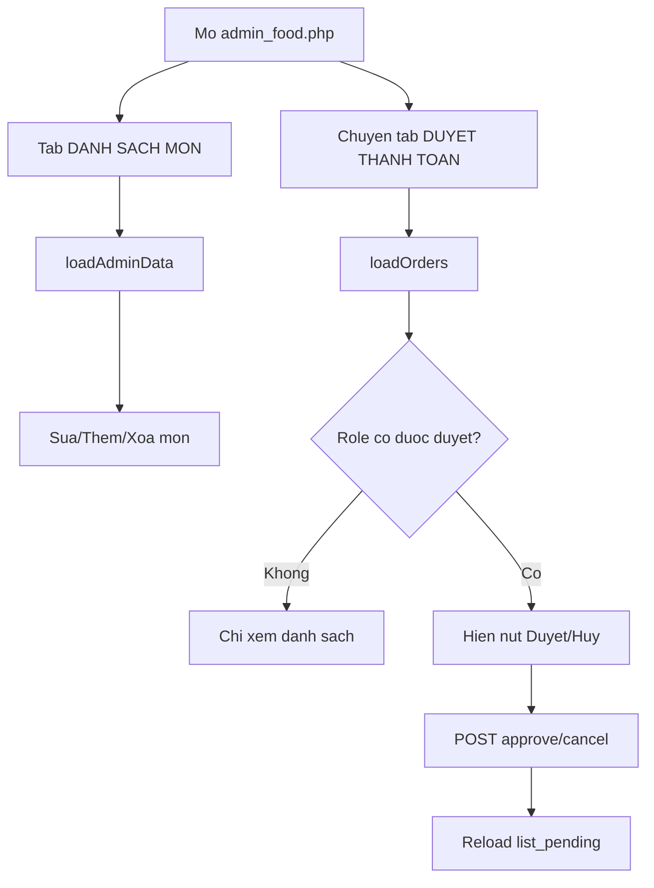

# Luong Frontend admin (admin-food.js)

## 1. Pham vi file
- View/pages/admin_food.php
- View/js/admin-food.js

## 2. Muc tieu man hinh
Trang admin food co 2 tab chinh:
1. `DANH SACH MON`: CRUD mon an.
2. `DUYET THANH TOAN`: danh sach payment dang `Cho xac nhan` + thao tac duyet/huy.

Quyen vao trang:
- Duoc vao trang: Admin, Manager, Employee.
- Quyen duyet/huy tren UI: chi Admin/Manager.

## 3. Luong tab va tai du lieu
### Mac dinh
- `window.onload = loadAdminData` -> tai tab danh sach mon.

### Chuyen tab
- `switchTab('food')`:
  - Hien section mon.
  - Goi lai `loadAdminData()`.
- `switchTab('order')`:
  - Hien section duyet thanh toan.
  - Goi `loadOrders()`.

## 4. Luong quan ly mon an (tab food)
### loadAdminData()
- Goi API `GET ../../Controllers/foodController.php?action=list_all`.
- Render bang mon an:
  - Hien ten, loai, gia, ton kho, trang thai.
  - Trang thai tinh theo ton kho frontend:
    - ton > 0 -> `Con`
    - ton = 0 -> `Het`

### Them/sua mon
- `openModal()` mo popup them moi.
- `editFood(index)` nap du lieu vao popup de sua.
- `saveFood()`:
  - Validate local:
    - ten khong rong
    - gia > 0
    - soLuongTon la so nguyen >= 0
  - Goi `POST ../../Controllers/foodController.php?action=save`
  - Thanh cong -> dong modal + reload danh sach mon.

### Xoa mon
- `deleteFood(id)` goi API:
  - `GET /QL_Rap_Chieu/Controllers/foodController.php?action=delete&foodId={id}`
- Thanh cong -> reload bang mon.

## 5. Luong duyet thanh toan (tab order)
### loadOrders()
- Goi API `GET ../../Controllers/paymentController.php?action=list_pending`.
- Lay `currentRole` tu response de xac dinh quyen thao tac.
- `canReview = currentRole === 'Admin' || currentRole === 'Manager'`.
- Neu payment co `paymentStatus = Cho xac nhan` va `canReview = true`:
  - Hien 2 nut `Duyet` va `Huy`.
- Nguoc lai (Employee hoac payment da xu ly):
  - Khong hien nut thao tac.

### Duyet/Huy
- `approvePayment(paymentId)` -> `submitPaymentAction('approve', ...)`.
- `cancelPayment(paymentId)` -> `submitPaymentAction('cancel', ...)`.
- `submitPaymentAction`:
  1. Hoi xac nhan qua `confirm`.
  2. Goi POST voi body `{ paymentId }`.
  3. Alert message tu API.
  4. Neu success -> reload danh sach pending.

## 6. Luu y hien thi du lieu
- Cot du lieu trong bang payment:
  - `paymentId`, `customerName`, `foodOrderId`, `bookingId`, `phuongThuc`, `tongTien`.
  - Trang thai: paymentStatus, foodOrderStatus, bookingStatus.
- `customerName` hien tai lay qua join FoodOrder -> Account, nen payment khong co foodOrder co the khong co ten khach.

## 7. So do luong admin

