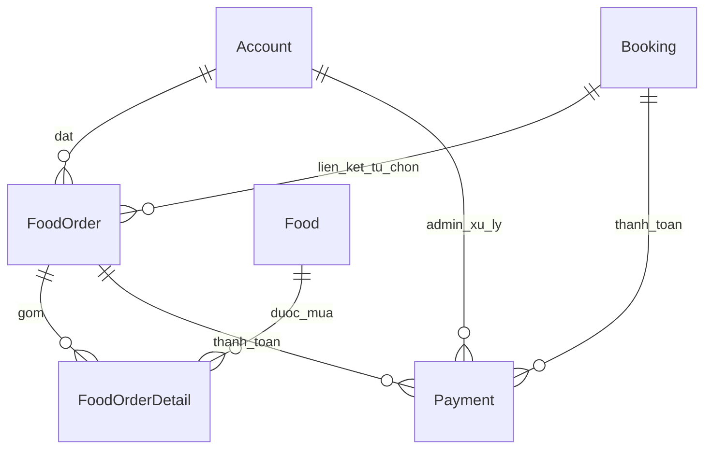

# Models va Schema lien quan Food

## 1. Danh sach model
- Models/foodModels.php
- Models/foodOrder.php
- Models/foodOrderDetail.php
- Models/payment.php

## 2. Model Food (foodModels.php)
### getAll()
- Query: `SELECT * FROM food ORDER BY foodId DESC`.

### save($data)
- Validate:
  - `tenFood` khong rong.
  - `loaiFood` khong rong.
  - `gia > 0`.
  - `soLuongTon >= 0`.
- Tu dong tinh `trangThai`:
  - ton > 0 -> `Con`
  - ton = 0 -> `Het`
- Neu co `foodId` -> UPDATE.
- Khong co `foodId` -> INSERT.

### delete($id)
- Xoa ban ghi Food theo foodId.

## 3. Model FoodOrder (foodOrder.php)
### create($accId, $bookingId, $total)
- Tao FoodOrder voi trang thai mac dinh `Cho xac nhan`.
- Ho tro 2 kieu:
  - `bookingId = NULL` (mua le do an).
  - `bookingId != NULL` (neu can lien ket booking).

### updateStatus($id, $status)
- Cap nhat trang thai FoodOrder theo payment flow.

## 4. Model FoodOrderDetail (foodOrderDetail.php)
### create($orderId, $foodId, $qty, $price)
- Luu chi tiet tung mon trong don.
- `giaLucMua` giup luu lich su gia tai thoi diem giao dich.

## 5. Model Payment (payment.php)
### create($bookingId, $foodOrderId, $tongTien, $phuongThuc)
Validate:
1. Khong duoc de ca `bookingId` va `foodOrderId` cung NULL.
2. `tongTien > 0`.
3. `phuongThuc` phai nam trong `Tien mat` hoac `The`.

Trang thai tao moi mac dinh: `Cho xac nhan`.

### getBookingInfoForCheckout(...)
- Co san de lay thong tin booking + gia ve (+ option `FOR UPDATE`).
- Luong Food hien tai khong goi ham nay.

### getPending(), getByStatus($status)
- Lay danh sach payment + join FoodOrder/Booking/Account.

### getByIdForUpdate($paymentId)
- Query Payment voi `FOR UPDATE` de lock dong khi approve/cancel.

### updateStatus($paymentId, $status, $adminId)
- Cap nhat trang thai Payment + adminId nguoi xu ly.

### updateBookingStatus($bookingId, $status)
- Dong bo trang thai Booking neu payment co bookingId.

## 6. Bang du lieu lien quan (theo ql_rap.sql)

## 6.1 Food
- `foodId` PK
- `tenFood`
- `loaiFood`
- `gia` DECIMAL(10,2)
- `soLuongTon` INT
- `trangThai` ENUM(`Con`, `Het`)

## 6.2 FoodOrder
- `foodOrderId` PK
- `accountId` FK -> Account
- `bookingId` FK -> Booking (NULL duoc)
- `ngayMua`
- `tongTienFood`
- `trangThai` ENUM(`Cho xac nhan`, `Da giao`, `Da huy`)

## 6.3 FoodOrderDetail
- `detailId` PK
- `foodOrderId` FK -> FoodOrder
- `foodId` FK -> Food
- `soLuong`
- `giaLucMua`

## 6.4 Payment
- `paymentId` PK
- `bookingId` FK -> Booking (NULL duoc)
- `foodOrderId` FK -> FoodOrder (NULL duoc)
- `tongTien`
- `phuongThuc` ENUM(`Tien mat`, `The`)
- `ngayThanhToan`
- `trangThai` ENUM(`Cho xac nhan`, `Da duyet`, `Da huy`)
- `adminId` FK -> Account (NULL duoc)

## 6.5 Booking (lien quan dong bo)
- `bookingId` PK
- `accountId` FK -> Account
- `scheduleId` FK -> Schedule
- `soLuong`
- `trangThai` ENUM(`Cho thanh toan`, `Da xac nhan`, `Da huy`)

## 7. Quan he du lieu

## 8. Quy tac trang thai chinh
1. Sau place_order Food:
   - FoodOrder = `Cho xac nhan`
   - Payment = `Cho xac nhan`
2. Sau approve:
   - Payment = `Da duyet`
   - FoodOrder = `Da giao` (neu co)
   - Booking = `Da xac nhan` (neu co)
3. Sau cancel:
   - Payment = `Da huy`
   - FoodOrder = `Da huy` (neu co)
   - Booking = `Da huy` (neu co)
