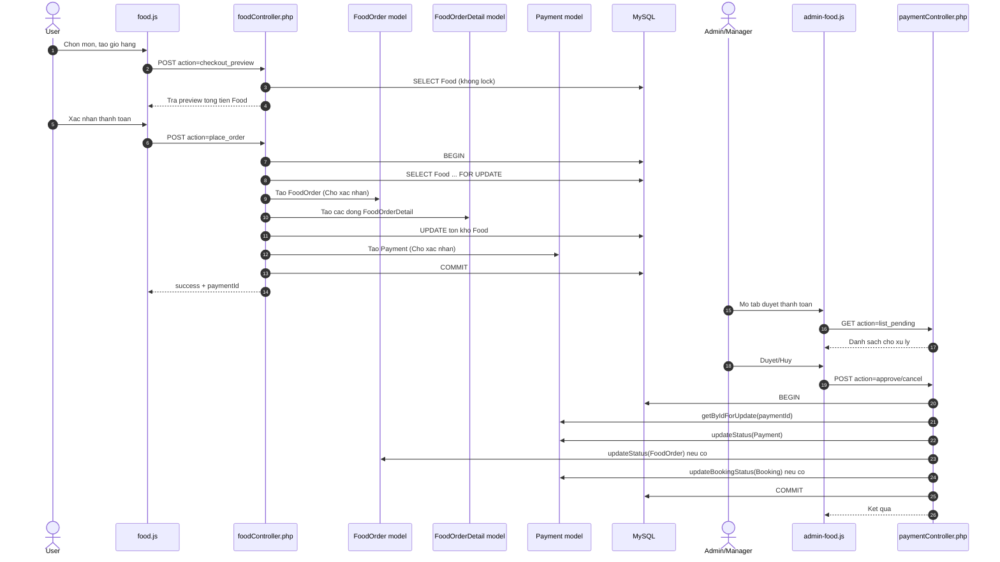

# Bo tai lieu luong Food (phien ban tach file)

## 1. Muc tieu
Tai lieu nay mo ta luong Food hien tai theo code moi da sua, tap trung vao:
- Mua do an rieng tai rap (khong gui bookingId trong payload Food).
- Thanh toan Food va duyet thanh toan boi Admin/Manager.
- Validate, transaction, lock du lieu va dong bo trang thai.

## 2. Diem thay doi chinh so voi ban cu
1. Luong Food checkout hien tai khong nhan bookingId.
2. Tong thanh toan trong luong Food = tong tien do an.
3. parseCheckoutPayload ep phuong thuc thanh toan thanh `Tien mat`.
4. place_order tao FoodOrder voi bookingId = NULL va Payment voi bookingId = NULL.
5. paymentController van co kha nang dong bo Booking neu Payment co bookingId (de dung chung voi luong khac).

## 3. So do tong quan

## 4. Danh muc tai lieu chi tiet
- [01-frontend-food-js.md](./01-frontend-food-js.md): Luong trang food va food_checkout (khach hang).
- [02-frontend-admin-food-js.md](./02-frontend-admin-food-js.md): Luong trang admin_food (quan ly + duyet thanh toan).
- [03-backend-food-controller.md](./03-backend-food-controller.md): Chi tiet action, validate, transaction trong foodController.
- [04-backend-payment-controller.md](./04-backend-payment-controller.md): Chi tiet list/approve/cancel trong paymentController.
- [05-models-and-schema.md](./05-models-and-schema.md): Model va schema lien quan Food/Order/Payment.
- [06-api-reference.md](./06-api-reference.md): API contract day du voi request/response mau.
- [07-test-checklist-and-scenarios.md](./07-test-checklist-and-scenarios.md): Checklist test nhanh va cac tinh huong quan trong.

## 5. Ban do ma nguon lien quan
### Frontend
- View/pages/food.php
- View/pages/food_checkout.php
- View/pages/admin_food.php
- View/js/food.js
- View/js/admin-food.js

### Backend
- Controllers/foodController.php
- Controllers/paymentController.php
- Controllers/auth.php

### Models
- Models/foodModels.php
- Models/foodOrder.php
- Models/foodOrderDetail.php
- Models/payment.php

### Database
- ql_rap.sql (Food, FoodOrder, FoodOrderDetail, Payment, Booking, Schedule, Account)

## 6. Thu tu de doc nhanh
1. README.md
2. 01-frontend-food-js.md
3. 03-backend-food-controller.md
4. 04-backend-payment-controller.md
5. 06-api-reference.md
6. 07-test-checklist-and-scenarios.md
