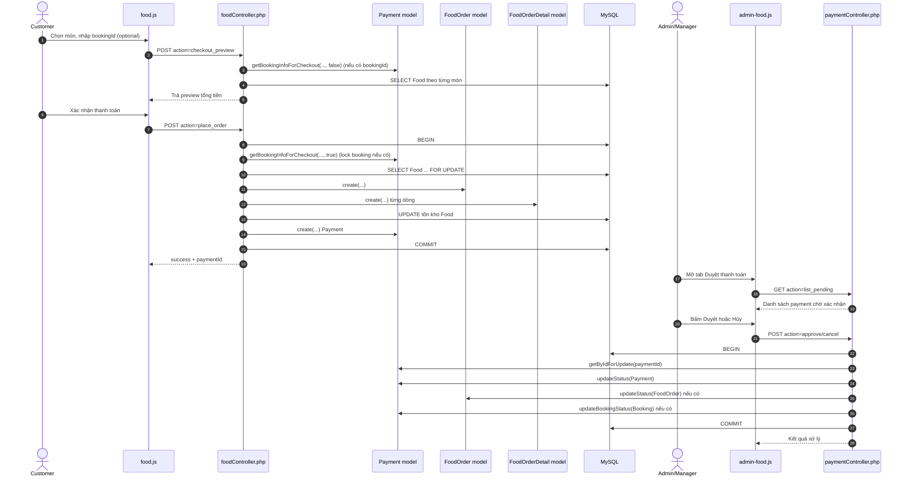

# Tài liệu chi tiết luồng Food và Payment

## 1. Mục tiêu
Tài liệu này mô tả đầy đủ luồng nghiệp vụ đồ ăn và thanh toán đang chạy trong code hiện tại, gồm:
- Luồng từ frontend đến backend.
- Các bước validate dữ liệu.
- Cơ chế transaction và lock dữ liệu.
- Luồng duyệt hoặc hủy thanh toán của Admin/Manager.
- Dữ liệu mẫu để test tay và đối soát.

## 2. Phạm vi và thành phần

### 2.1 Frontend liên quan
- View/pages/food.php
- View/pages/food_checkout.php
- View/js/food.js
- View/js/admin-food.js

### 2.2 Backend liên quan
- Controllers/foodController.php
- Controllers/paymentController.php

### 2.3 Model liên quan
- Models/foodModels.php
- Models/foodOrder.php
- Models/foodOrderDetail.php
- Models/payment.php

### 2.4 Bảng dữ liệu liên quan
- Food
- FoodOrder
- FoodOrderDetail
- Payment
- Booking
- Schedule
- Account

## 3. Bản đồ API nhanh

| API | Method | Quyền | Mục đích |
|---|---|---|---|
| /Controllers/foodController.php?action=list_all | GET | Admin, Manager, Employee, Customer | Lấy danh sách món |
| /Controllers/foodController.php?action=save | POST | Admin, Manager | Thêm hoặc sửa món |
| /Controllers/foodController.php?action=delete&foodId={id} | GET | Admin | Xóa món |
| /Controllers/foodController.php?action=checkout_preview | POST | Admin, Manager, Employee, Customer | Preview thanh toán food + vé |
| /Controllers/foodController.php?action=place_order | POST | Admin, Manager, Employee, Customer | Tạo FoodOrder, FoodOrderDetail, Payment |
| /Controllers/paymentController.php?action=list_pending | GET | Admin, Manager, Employee | Lấy payment chờ xác nhận |
| /Controllers/paymentController.php?action=approve | POST | Admin, Manager | Duyệt thanh toán |
| /Controllers/paymentController.php?action=cancel | POST | Admin, Manager | Hủy thanh toán |

## 4. Sơ đồ tổng quan



## 5. Luồng khách hàng chi tiết

### 5.1 Bước 1: Lấy danh sách món
API:
- GET /Controllers/foodController.php?action=list_all

Xử lý:
1. Controller gọi checkAuth với 4 role.
2. Gọi Food::getAll() đọc dữ liệu từ bảng Food theo foodId DESC.
3. Trả JSON success/data.

Ví dụ response:
```json
{
  "success": true,
  "message": "Lấy danh sách món thành công",
  "data": [
    {
      "foodId": 2,
      "tenFood": "Coca",
      "loaiFood": "Nước",
      "gia": "30000.00",
      "soLuongTon": 100,
      "trangThai": "Còn"
    },
    {
      "foodId": 1,
      "tenFood": "Bắp Caramel",
      "loaiFood": "Bắp",
      "gia": "65000.00",
      "soLuongTon": 50,
      "trangThai": "Còn"
    }
  ]
}
```

### 5.2 Bước 2: Tạo checkout draft ở frontend
Trong View/js/food.js:
1. Người dùng thêm món vào biến cart.
2. Nhập bookingId (có thể để trống).
3. Bấm THÀNH TOÁN NGAY.
4. Frontend tạo draft và lưu sessionStorage với key food_checkout_draft_v1.
5. Điều hướng sang food_checkout.php.

Ví dụ draft:
```json
{
  "bookingId": 120,
  "phuongThuc": "Tiền mặt",
  "items": [
    { "foodId": 1, "tenFood": "Bắp Caramel", "price": 65000, "soLuong": 2 },
    { "foodId": 2, "tenFood": "Coca", "price": 30000, "soLuong": 3 },
    { "foodId": 1, "tenFood": "Bắp Caramel", "price": 65000, "soLuong": 1 }
  ]
}
```

### 5.3 Bước 3: Preview checkout
API:
- POST /Controllers/foodController.php?action=checkout_preview

Input mẫu:
```json
{
  "bookingId": 120,
  "phuongThuc": "Tiền mặt",
  "items": [
    { "foodId": 1, "soLuong": 2 },
    { "foodId": 2, "soLuong": 3 },
    { "foodId": 1, "soLuong": 1 }
  ]
}
```

Luồng validate và tính toán:
1. Kiểm tra session user và accountId.
2. parseCheckoutPayload:
   - items phải là mảng, không rỗng.
   - mỗi item phải có foodId > 0, soLuong > 0.
   - gộp các món trùng foodId thành normalizedItems.
   - bookingId nếu có phải là số nguyên dương.
   - ép phuongThuc = "Tiền mặt".
3. Nếu có bookingId:
   - lấy booking bằng Payment::getBookingInfoForCheckout(bookingId, accountId, false).
   - booking phải thuộc user hiện tại.
   - booking không được là "Đã hủy".
   - tính ticketTotal = soLuong * giaVe.
4. Duyệt từng món trong normalizedItems:
   - kiểm tra món tồn tại.
   - kiểm tra tồn kho > 0 và đủ số lượng.
   - kiểm tra giá > 0.
   - tính thành tiền từng món và cộng tổng foodTotal.
5. Tính tongTienThanhToan = tongTienFood + tongTienVe.
6. Trả object preview cho frontend hiển thị.

Response mẫu thành công:
```json
{
  "success": true,
  "message": "Lấy thông tin thanh toán thành công.",
  "data": {
    "items": [
      {
        "foodId": 1,
        "tenFood": "Bắp Caramel",
        "gia": 65000,
        "soLuong": 3,
        "thanhTien": 195000,
        "soLuongTon": 50,
        "trangThai": "Còn"
      },
      {
        "foodId": 2,
        "tenFood": "Coca",
        "gia": 30000,
        "soLuong": 3,
        "thanhTien": 90000,
        "soLuongTon": 100,
        "trangThai": "Còn"
      }
    ],
    "booking": {
      "bookingId": 120,
      "soLuongVe": 2,
      "giaVe": 90000,
      "tongTienVe": 180000,
      "trangThai": "Chờ thanh toán"
    },
    "tongTienFood": 285000,
    "tongTienVe": 180000,
    "tongTienThanhToan": 465000,
    "phuongThuc": "Tiền mặt"
  }
}
```

Response lỗi ví dụ:
```json
{ "success": false, "message": "Số lượng tồn không đủ cho món: Bắp Caramel" }
```

### 5.4 Bước 4: Place order (transaction)
API:
- POST /Controllers/foodController.php?action=place_order

Input thường giống checkout_preview.

Trình tự xử lý trong transaction:
1. BEGIN.
2. Validate payload giống preview.
3. Nếu có bookingId:
   - getBookingInfoForCheckout(..., true) để lock booking bằng FOR UPDATE.
4. Duyệt từng món:
   - SELECT Food ... FOR UPDATE để lock dòng món.
   - kiểm tra tồn tại, tồn kho, giá.
   - gom dữ liệu vào detailRows và cộng foodTotal.
5. Tạo FoodOrder (trạng thái mặc định "Chờ xác nhận").
6. Tạo FoodOrderDetail cho từng món.
7. Trừ tồn kho Food và cập nhật trạng thái Còn hoặc Hết.
8. Tạo Payment (trạng thái mặc định "Chờ xác nhận").
9. COMMIT khi toàn bộ bước thành công.
10. ROLLBACK nếu có bất kỳ exception nào.

Response mẫu thành công:
```json
{
  "success": true,
  "message": "Đặt món thành công. Đơn hàng đang chờ xác nhận.",
  "data": {
    "foodOrderId": 500,
    "paymentId": 900,
    "bookingId": 120,
    "tongTienFood": 285000,
    "tongTienVe": 180000,
    "tongTienThanhToan": 465000,
    "phuongThuc": "Tiền mặt",
    "trangThaiThanhToan": "Chờ xác nhận"
  }
}
```

## 6. Luồng Payment của Admin hoặc Manager

### 6.1 Xem danh sách chờ xác nhận
API:
- GET /Controllers/paymentController.php?action=list_pending

Quyền:
- Admin, Manager, Employee

Lưu ý UI:
- Employee chỉ xem danh sách.
- Admin/Manager mới thấy nút Duyệt và Hủy ở admin-food.js.

Response mẫu:
```json
{
  "success": true,
  "message": "Lấy danh sách thanh toán chờ xác nhận thành công",
  "data": {
    "currentRole": "Manager",
    "payments": [
      {
        "paymentId": 900,
        "bookingId": 120,
        "foodOrderId": 500,
        "tongTien": "465000.00",
        "phuongThuc": "Tiền mặt",
        "ngayThanhToan": "2026-04-18 15:10:00",
        "paymentStatus": "Chờ xác nhận",
        "tongTienFood": "285000.00",
        "foodOrderStatus": "Chờ xác nhận",
        "ngayMua": "2026-04-18 15:10:00",
        "bookingStatus": "Chờ thanh toán",
        "customerName": "Nguyễn Văn A"
      }
    ]
  }
}
```

### 6.2 Duyệt thanh toán
API:
- POST /Controllers/paymentController.php?action=approve

Body mẫu:
```json
{ "paymentId": 900 }
```

Transaction backend:
1. BEGIN.
2. getByIdForUpdate(paymentId) để lock payment.
3. Kiểm tra payment tồn tại, trạng thái đang là "Chờ xác nhận", tongTien > 0.
4. Cập nhật Payment:
   - trangThai = "Đã duyệt"
   - adminId = accountId người duyệt
5. Nếu có foodOrderId, cập nhật FoodOrder = "Đã giao".
6. Nếu có bookingId, cập nhật Booking = "Đã xác nhận".
7. COMMIT.

Response mẫu:
```json
{
  "success": true,
  "message": "Duyệt thanh toán thành công",
  "data": {
    "paymentId": 900,
    "paymentStatus": "Đã duyệt",
    "foodOrderId": 500,
    "bookingId": 120
  }
}
```

### 6.3 Hủy thanh toán
API:
- POST /Controllers/paymentController.php?action=cancel

Body mẫu:
```json
{ "paymentId": 901 }
```

Đồng bộ trạng thái khi hủy:
- Payment -> "Đã hủy"
- FoodOrder -> "Đã hủy"
- Booking -> "Đã hủy"

Response mẫu:
```json
{
  "success": true,
  "message": "Hủy thanh toán thành công",
  "data": {
    "paymentId": 901,
    "paymentStatus": "Đã hủy",
    "foodOrderId": 501,
    "bookingId": 121
  }
}
```

## 7. Trạng thái và quy tắc chuyển trạng thái

| Bảng | Cột | Giá trị |
|---|---|---|
| Food | trangThai | Còn, Hết |
| FoodOrder | trangThai | Chờ xác nhận, Đã giao, Đã hủy |
| Payment | trangThai | Chờ xác nhận, Đã duyệt, Đã hủy |
| Booking | trangThai | Chờ thanh toán, Đã xác nhận, Đã hủy |

Quy tắc chính:
1. Sau place_order thành công:
   - FoodOrder = Chờ xác nhận
   - Payment = Chờ xác nhận
   - Booking giữ nguyên trạng thái hiện tại
2. Sau approve:
   - Payment = Đã duyệt
   - FoodOrder = Đã giao
   - Booking = Đã xác nhận
3. Sau cancel:
   - Payment = Đã hủy
   - FoodOrder = Đã hủy
   - Booking = Đã hủy

## 8. Dữ liệu mẫu đầy đủ để test

### 8.1 Seed tối thiểu
```sql
INSERT INTO Account (accountId, username, password, hoTen, role)
VALUES
  (2, 'admin1', 'hashed', 'Trần Thị Quản Lý', 'Manager'),
  (10, 'customer1', 'hashed', 'Nguyễn Văn A', 'Customer');

INSERT INTO Schedule (scheduleId, movieId, roomId, ngayChieu, gioChieu, giaVe, isCancelled)
VALUES (55, 1, 1, '2026-04-19', '19:30:00', 90000, 0);

INSERT INTO Booking (bookingId, accountId, scheduleId, soLuong, trangThai)
VALUES (120, 10, 55, 2, 'Chờ thanh toán');

INSERT INTO Food (foodId, tenFood, loaiFood, gia, soLuongTon, trangThai)
VALUES
  (1, 'Bắp Caramel', 'Bắp', 65000, 50, 'Còn'),
  (2, 'Coca', 'Nước', 30000, 100, 'Còn');
```

### 8.2 Request place_order mẫu
```json
{
  "bookingId": 120,
  "items": [
    { "foodId": 1, "soLuong": 2 },
    { "foodId": 2, "soLuong": 3 },
    { "foodId": 1, "soLuong": 1 }
  ]
}
```

Kết quả chuẩn hóa item ở backend:
- foodId 1: 3 phần
- foodId 2: 3 phần

Tính tiền:
- Tiền food = 3 x 65000 + 3 x 30000 = 285000
- Tiền vé = 2 x 90000 = 180000
- Tổng thanh toán = 465000

### 8.3 Snapshot DB kỳ vọng sau place_order
FoodOrder:
```sql
foodOrderId = 500
accountId = 10
bookingId = 120
tongTienFood = 285000
trangThai = 'Chờ xác nhận'
```

FoodOrderDetail:
```sql
(detailId=1, foodOrderId=500, foodId=1, soLuong=3, giaLucMua=65000)
(detailId=2, foodOrderId=500, foodId=2, soLuong=3, giaLucMua=30000)
```

Food tồn kho:
```sql
foodId=1: soLuongTon 50 -> 47, trangThai='Còn'
foodId=2: soLuongTon 100 -> 97, trangThai='Còn'
```

Payment:
```sql
paymentId = 900
bookingId = 120
foodOrderId = 500
tongTien = 465000
phuongThuc = 'Tiền mặt'
trangThai = 'Chờ xác nhận'
adminId = NULL
```

### 8.4 Snapshot DB sau approve
Nếu Manager accountId=2 duyệt paymentId=900:
```sql
Payment(900).trangThai = 'Đã duyệt'
Payment(900).adminId = 2
FoodOrder(500).trangThai = 'Đã giao'
Booking(120).trangThai = 'Đã xác nhận'
```

### 8.5 Snapshot DB sau cancel
Nếu hủy payment thay vì duyệt:
```sql
Payment(900).trangThai = 'Đã hủy'
FoodOrder(500).trangThai = 'Đã hủy'
Booking(120).trangThai = 'Đã hủy'
```

## 9. Các lỗi thường gặp và thông điệp backend

| Tình huống | API | Thông điệp thường gặp |
|---|---|---|
| Chưa đăng nhập hoặc session hết hạn | checkout_preview, place_order | Phiên đăng nhập đã hết hạn, vui lòng đăng nhập lại. |
| bookingId không hợp lệ | checkout_preview, place_order | Mã booking không hợp lệ. |
| booking không thuộc user | checkout_preview, place_order | Không tìm thấy booking hợp lệ của tài khoản hiện tại. |
| booking đã hủy | checkout_preview, place_order | Booking đã bị hủy, không thể thanh toán kèm đồ ăn. |
| món không tồn tại | checkout_preview, place_order | Có món ăn không còn tồn tại trong hệ thống. |
| món hết hàng | checkout_preview, place_order | Món đã hết hàng: {tenFood} |
| tồn kho không đủ | checkout_preview, place_order | Số lượng tồn không đủ cho món: {tenFood} |
| tổng tiền lỗi | checkout_preview, place_order | Tổng thanh toán không hợp lệ. |
| payment đã xử lý trước đó | approve, cancel | Thanh toán đã được xử lý trước đó |

## 10. Lưu ý kỹ thuật quan trọng
1. parseCheckoutPayload đang ép phương thức thanh toán thành "Tiền mặt".
2. Model Payment vẫn cho phép cả "Tiền mặt" và "Thẻ", nhưng luồng food hiện tại chỉ sinh "Tiền mặt".
3. place_order và approve/cancel đều có transaction nên tránh được trạng thái nửa vời.
4. Dòng Food được lock bằng FOR UPDATE để giảm race condition khi nhiều user mua cùng lúc.
5. update tồn kho có điều kiện `soLuongTon >= ?`, nếu fail sẽ ném lỗi và rollback toàn bộ.

## 11. Checklist test nhanh
1. Mua lẻ không có bookingId vẫn tạo được FoodOrder và Payment.
2. bookingId hợp lệ nhưng thuộc account khác phải bị chặn.
3. Gửi trùng foodId nhiều dòng phải được gộp đúng số lượng.
4. Tồn kho không đủ phải rollback toàn bộ, không tạo bản ghi dở dang.
5. Duyệt cùng một payment 2 lần, lần thứ 2 phải báo đã xử lý.
6. Employee xem list_pending được nhưng không có nút duyệt hoặc hủy ở UI.
